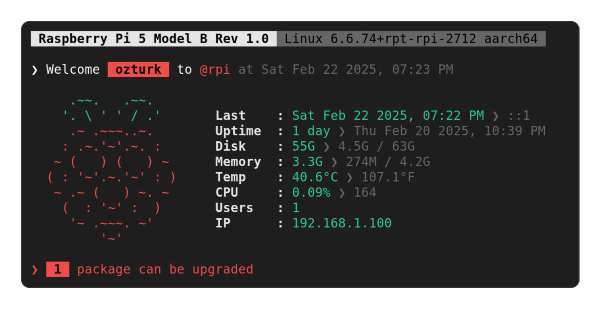

# Raspberry Pi MOTD

This repository contains scripts and configurations to update the Message of the Day (MOTD) on a Raspberry Pi.

## Table of Contents
- [Installation](#installation)
- [Structure](#structure)
- [Configuration](#configuration)
- [License](#license)

## Screenshots


## Installation

To install the update-motd scripts on your Raspberry Pi, follow these steps:

1. Clean previous motd scripts:
    ```sh
    sudo rm -rf /etc/update-motd.d/*
    ```

You can use `.deb` [package releases](https://github.com/ozmeta/motd-raspberrypi/releases) to automate steps from there.

2. Clone the repository:
    ```sh
    git clone https://github.com/ozmeta/motd-raspberrypi.git
    cd motd-raspberrypi
    ```

3. Install the motd-raspberrypi:
    ```sh
    sudo make install
    ```

## Structure

The installed structure is organized as follows:

```bash
/
├── etc
│   ├── update-motd.d
│   │   └── motd-raspberrypi
│   └── motd-config (optional)
```

### Description of Key Files & Directories:

- **`etc/motd-config`**: Configuration file created by user optionally to overwrite configuration.
- **`etc/update-motd.d/`**: Directory containing MOTD scripts:
    - **`motd-raspberrypi`**: Displays the Raspberry Pi MOTD.

## Configuration

After installation, you can configure the MOTD by either directly editing the configuration in the `/etc/update-motd.d/motd-raspberrypi` motd file or creating a overwriting configuration file as `/etc/motd-config`.

1. Open the MOTD file (or optionally create a configuration file at `/etc/motd-config`):
    ```sh
    sudo nano /etc/update-motd.d/motd-raspberrypi
    ```

2. Modify the content as needed:
    - **`DATE_FORMAT`**: Set the date format. [(More information)](https://www.cyberciti.biz/faq/linux-unix-formatting-dates-for-display/)
        - 12-Hour: `%a %b %d %Y, %I:%M %p`
        - 24-Hour: `%a %b %d %Y, %H:%M`
    - **`BULLET`**: Set a custom bullet point character (e.g., `❯`, `*`, `-`).
    - **`COLON`**: Set a custom colon character (e.g., `:`, `.`, etc.).
    - **`STYLES`**: Define the main styles used throughout the MOTD. Each style can combine color and text attributes: [(More information)](https://misc.flogisoft.com/bash/tip_colors_and_formatting)
        - `PRIMARY`: The primary style (e.g., `\e[91m`).
        - `SECONDARY`: The secondary style (e.g., `\e[92m`).
        - `TITLE`: The style for titles (e.g., `\e[37;1m`).
        - `SUBTITLE`: The style for subtitles (e.g., `\e[90m`).
        - Inverted versions: `INV_PRIMARY`, `INV_SECONDARY`, `INV_TITLE`, `INV_SUBTITLE` (add 10 to the non-inverted color codes).
    - **`ASCII_ART`**: Custom ASCII art. You can remove the custom ASCII if you don't like it.
        ```
        \e[92m   .~~.   .~~.
        \e[92m  '. \ ' ' / .'
        \e[91m   .~ .~~~..~.
        \e[91m  : .~.'~'.~. :
        \e[91m ~ (   ) (   ) ~
        \e[91m( : '~'.~.'~' : )
        \e[91m ~ .~ (   ) ~. ~
        \e[91m  (  : '~' :  )
        \e[91m   '~ .~~~. ~'
        \e[91m       '~'
        ```
    - **`SYSTEM_INFO`**: System info management to view.
        - `#`: Title of the information.
        - `!`: Commands to fetch the information.
        - `--`: Add a bullet character and mute the style of the next information(s).
        - `*`: Add custom characters as you wish.
        ```
        #Memory !memory_free -- !memory_used / !memory_size
        ```
        ```
        Memory  : 3.3G ❯ 277M / 4.2G
        ```
    - **`Print MOTD`**: If you understand how the script works, you can further customize the printing order of the elements and their visibility at the end of the script (`/etc/update-motd.d/motd-raspberrypi`).

## License

This project is licensed under the MIT License. See the [LICENSE](LICENSE) file for more details.
